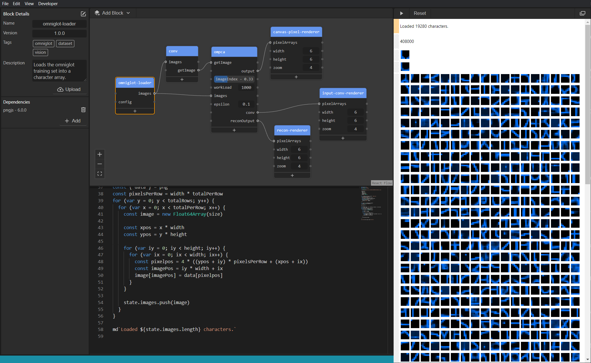

# 0x00 (NULL)



## What is this?

Null is a new type of javascript IDE whose goal is to help you get your ideas to working code as fast as possible. It borrows elements from all sorts of different coding environments, but the key features are:

- Code is data driven, responding to changes from other code blocks.
- Code blocks have a persistent state, so you can change and run your code on the fly.
- Code blocks can be uploaded and shared (similar to npm, but higher specificity)
- Interactive properties can be created (eg. sliders, color and file pickers, etc).
- npm modules can be installed instantly for any block

## Installation / Setup

Currently there is no production build for Null, so below is how to get started using the dev environment.

```
clone the repo
npm install
npm run dev
```

Note that there are 3 concurrent processes running for this project. The first is the UI thread, which handles the IDE front end. The second is the Engine thread. This handles running the programs you create. The third is the electron app itself, housing everything. Each of these processes can be run independently if you want better logging in the console.

## Global Block Variables

There are a few variables available to your block code to make things easier. Some relate to the visual side of the engine, the state system, or just general helpers

### `element` & template helpers: (`md`, `html`)

`element` is the root dom element provided to the block. It is a `div` part of a shadow dom, so any styling, etc. won't pollute other block areas. To find children, use `element.querySelector()` instead of `document.getElementById()`, as shadow dom id's won't be accessible.

Also provided are helper string template literals to embed different content easily inside your block div. These run in order, and will overwrite each other if multiple are used. At the present time there are only two options. `md` for outputting markdown, and `html` for outputting raw html. For example.

```
md`##Hello, this is a title in markdown`
```

```
// html`` returns the outer element for easy use
const theH2 = html`<h2 id="#title">This is a title using html</h2>`
```

### `state` & `stateUpdated(propertyName)`

This is the persistent state object for your block, as well as the glue that lets you read and write to block properties. Whenever the block is rerun (either via a code change or a connection update), this state remains unchanged. Only a full program reset will reset the state to an empty object.

If you set a value on the state whose key matches the name of a property, any block with a connection from this property will be rerun with this newly updated value.

For example:

```
// If a block has a property called myValue, then any other blocks this property connects to will be rerun when this value is set
state.myValue = 100

// This set below will not trigger a state update, as only top level state keys are watched
state.myObject.childKey = 10

// this will force an update message that state.myObject has been updated, triggering a connected block to rerun
stateUpdated('myObject')
```

### `onChange(runFunc, [depArray], ignoreInitialLoad)`

Code inside a block reruns whenever the code changes, or whenever input state values change. Usually you want to run some sort of initialisation code that only runs once, or you might want some code to run whenever specific values change, or on say a button click. This can be done using the `onChange()` function. The first param `runFunc` is a function that runs whenever any of the `[depArray]` changes. An empty `depArray` will only run once (first run of the block), and it useful for state initialisation. Setting `ignoreInitialLoad` to true will cause the `runFunc` to ONLY run when the deps change. It will not run during the first run pass.

`onChange` can be used multiple times, and they will run in execution order.

```
// this will only run once on start creating a canvas
onChange(() => {
  html`<canvas id="c"/>`
}, [])

// this will run whenever the state.myValue is changed (including on first run)
onChange(() => {
  // do something whenever specific state changes
}, [state.myValue])

// this will only run when state.test is changed, it will not run on first pass
onChange(() => {
  // do something
}, [state.test], true)

console.log(element.querySelector('#c')) // this will log the canvas that was set up int he first example above.
```

**Cleanup on block removal**

Sometimes you want to run cleanup code when a block is removed. If you return a function from within an `onChange()` `runFunc`, this function will be run whenever a block is removed. For example:

```
onChange(() => {
  // do initialisation work here

  // return a function that you want to run when a block is removed
  return () => {
    // do cleanup here
  }
}, [])
```

This is useful for situations where you want to set something up on first run (a webcam for example), which requires shut down code when finished using (so that a program reset wouldn't try and initialise again over the top of previous code).

### Animations

A powerful feature of null is the ability to have blocks run animation loops, allowing you to update and propagate state through the program. To do this you just need to use `requestAnimationFrame()` in the same way you would in any other javascript program. Behind the scenes Null has rewritten the raf to manage state propagation. Inside the program settings, the frameRate for raf can also be changed if needed. This allows you to run more or less work in a block per render pass.

```
// this will update and propagate counter state each frame, also updating some markdown output
state.counter = 0

function run() {
  md`The counter is at: ${state.counter}`
  state.counter++
  requestAnimationFrame(run)
}

run()
```

While animations are running, the program pause button also works as expected, halting the program at the last raf call until play is pressed.

### `__dirname`

This is the file system path for the block. It is useful for doing things like loading files that have block relative paths.
